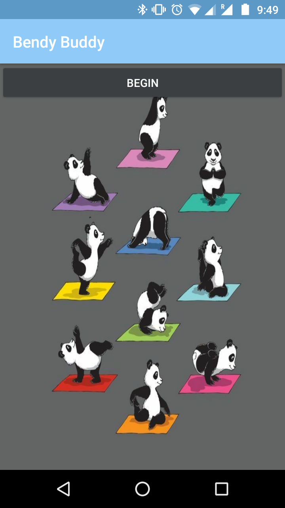
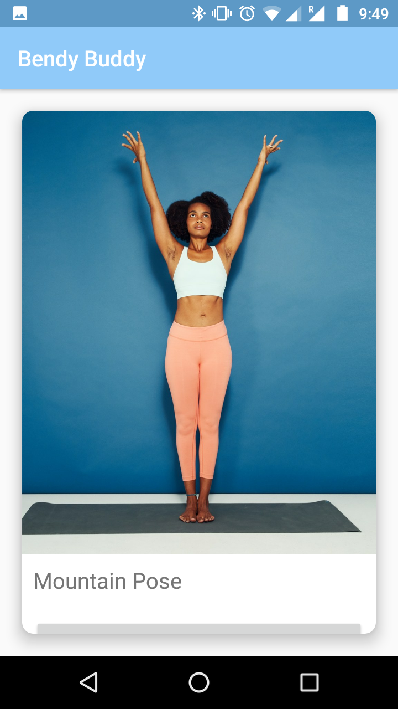

# TensorFlow Lite PoseNet For Yoga Learning
### Overview
This app allows users to learn yoga poses through pose detection software. It captures body pose in real-time and compares it to the actual pose required for each position. 

## Requirements
Android Studio 3.4+, PoseNet Tensorflow lite project
### Software used 
Kotlin, Tensorflow lite with pre-trained PoseNet
### Technology and techniques
Android development, Artificial Intelligence for Body Pose Estimation, Cosine similarity for estimating pose differences

### References
[Tensorfow documentation - Pose Estimation](https://www.tensorflow.org/lite/models/pose_estimation/overview)

